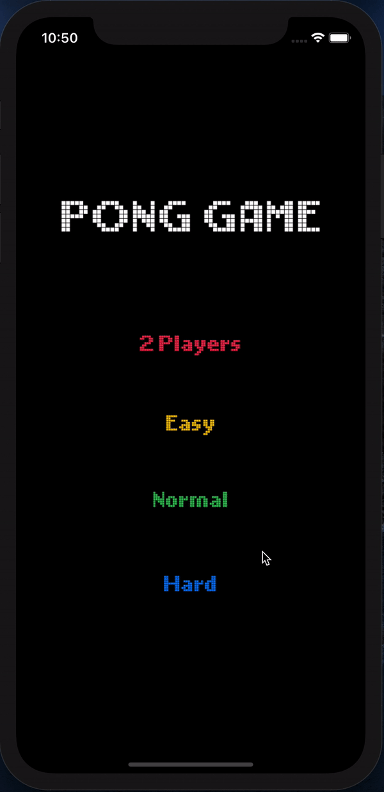
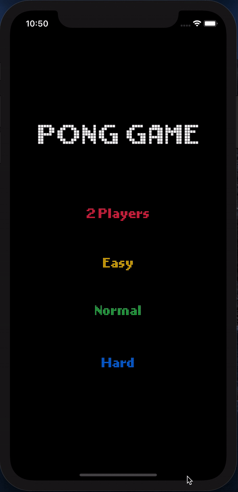

# 🏓 Pong-Game

> 난이도에 따라 상단바의 속도가 달라집니다.

## 1️⃣ 메인 화면


</br>

## 2️⃣ 2 Player 모드


</br>


## 3️⃣ Easy 모드


</br>


## 4️⃣ Normal 모드




</br>


## 5️⃣ Hard 모드




</br>


## 👩🏻‍💻 기본 개념

1. #### SKSpriteNode()

   > 물체의 형태를 나타내준다. 

   ```swift
   var ball = SKSpriteNode()
   var enemy = SKSpriteNode()
   var main = SKSpriteNode()
       
   var topLabel = SKLabelNode()
   var bottonLabel = SKLabelNode()
   ```

   
   
   </br>
   
   
   
   > 오버라이드 된 didMove 함수 내부에 형태와 포지션을 정의해준다.
   
   ```swift
    override func didMove(to view: SKView) {
       
           topLabel = self.childNode(withName: "topLabel") as! SKLabelNode
           bottonLabel = self.childNode(withName: "bottomLabel") as! 	SKLabelNode
           
           ball = self.childNode(withName: "ball") as! SKSpriteNode
           enemy = self.childNode(withName: "enemy") as! SKSpriteNode
           enemy.position.y = (self.frame.height / 2) - 50
           
           main = self.childNode(withName: "main") as! SKSpriteNode
           main.position.y = (-self.frame.height / 2) + 50
           
           // 시뮬레이션을 나타낼 공간을 할당
           let border = SKPhysicsBody(edgeLoopFrom: self.frame)
           
      			// 
           border.friction = 0
           border.restitution = 1
           
           self.physicsBody = border
           
           startGame()
       }
   
       func startGame(){
           score = [0,-1]
           topLabel.text = "\(score[1])"
           bottonLabel.text = "\(score[0])"
           
           ball.physicsBody?.applyImpulse(CGVector(dx: 10, dy: 10))
       }
   ```
   
   

2. #### .applyImpulse()

   > 움직임을 이용하기 위해 사용

   ```swift
   ball.physicsBody?.applyImpulse(CGVector(dx: 10, dy: 10))
   ```

   

3. #### Touch Movement 감지

   > SKAction.moveTo() 사용

   ```swift
   // x축 이동
   for touch in touches{
       let location = touch.location(in: self)
   		enemy.run(SKAction.moveTo(x: location.x, duration: 0.2))
   }
   ```

   

